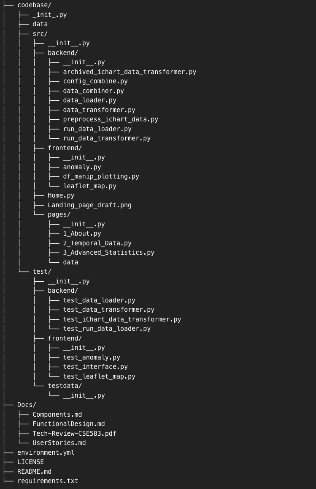
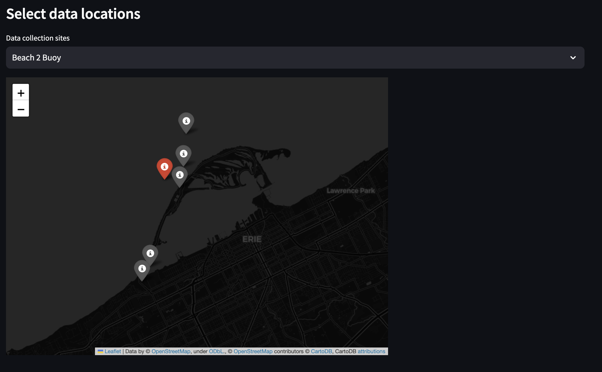
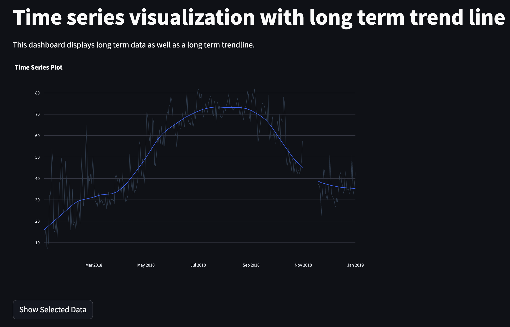
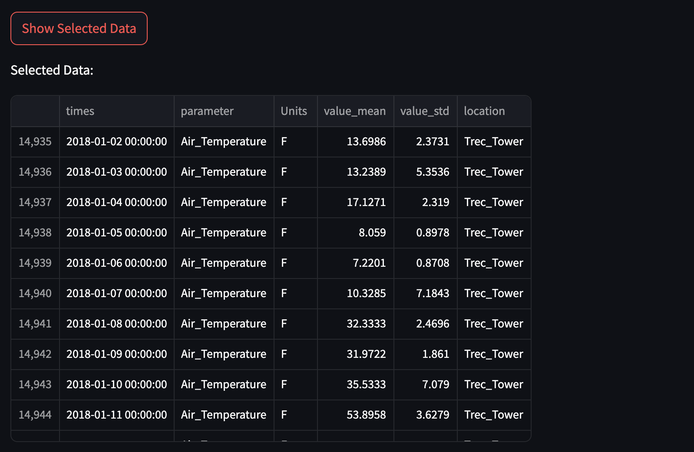
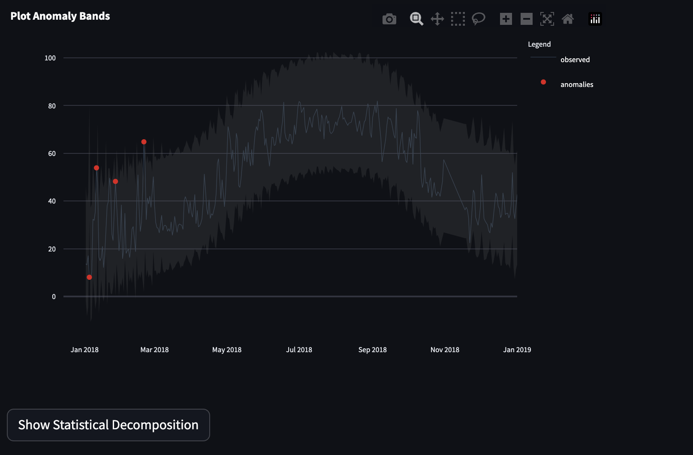
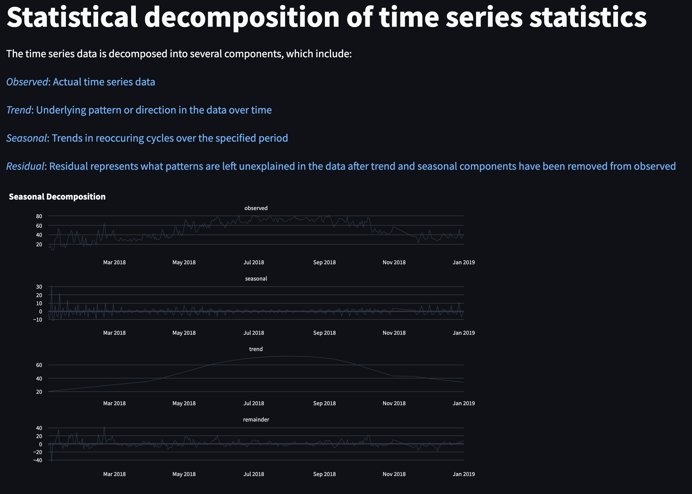

# Lake Erie Buoy Water Analysis Reporting Environment: **B-ware**

#### Table of Contents

[Background](#background)  
[Data Definitions](#data-definitions)  
[Project Layout](#project-layout)  
[Data](#data)  
[Data Definitions](#data-definitions)  
[Motivation](#motivation)  
[Raw Data](#raw-data)  
[Processed Data](#processed-data)  
[Recreating the Processed Data Files](#recreating-the-processed-data-files)  
[Downloading Data](#downloading-data)  
[Downloading Raw Data from WQ Data Website](#downloading-the-raw-old-and-new-data-from-wqdata-website)  
[Version 2: Live Data](#version-2-live-data)  
[Streamlit Deployment](#streamlit-deployment)  
[Temporal Data](#temporal-data)
[Advanced Statistics](#advanced-time-series-statistics-and-anomaly-detection)  
[Bugs](#bugs)

# Background

This repo creates a [web-based dashboard](https://lkerie.streamlit.app/) which displays trends in limnological and environmental data from weather bouys and stations in and around Lake Erie. These stations are deployed by the [Regional Science Consortium](https://www.regsciconsort.com/). The user interface will allow stakeholders to view trends in data.

#### Users will be able to:

- View climate data at station locations over time
- View complex statistical trends
- Explore live data (V2.0)

# Project Layout:



# Data

## Data definitions:

### Project

Throughout the backend code, project is used to describe which time period the data is coming from. In this instance, data is pulled data from three sources:

- ichart - data between 2006 - 2011
- "old" project database on WQData live\* - data between 2014 - 2020
- "new" project database on WQData live\* - data between 2014 - present

\*link for WQData live: https://www.wqdatalive.com/

### Device

Each data logger deployed by the Regional Science Consortium has a device id and name. For any data visualization tools or filenames, the device name is used. These are not always held constant in the raw data across projects.

Example: TREC_Tower

### Parameter

Each device has a suite of parameters that it measures. These are not the same for every device, as the loggers have different hardware.

Example: Air_Temperature

## Motivation

The data manipulation performed was a crucial part of this project, and will be a huge help to the Regional Science Consortium. The data was split across 3 different databases, 2 of which the regional science consortium could not access, nor did they know where it was located. The data across all 3 projects, spanning 15+ years, was very messy and inconsistent. There were multiple changes to the Device name (location, ex: “TREC_Tower” and “TREC_Tower_iSIC”), Parameter name for a given device (“DO” and “ODO”), Parameter name across devices, and units for a given parameter. Merging all of the data sets and standardizing the format proved to be quite the time-intesive challenge.

## Raw data

The raw data comes from the Regional Science Consortium and their weather devices on lake erie. Specifically, the data used in this repository comes from three different projects:

- iChart6 – an archived database managed by nexsens
- WQDatalive project “Regional Science Consortium (Old)” – an archived database managed by nexsens
- WQDatalive project “Regional Science Consortium (new)” – a current database managed by nexsens

The method of data collection was not constant across parameters, devices, or projects. Tower locations collect data every 10 minutes, some buoys collect data every 20 minutes, and lastly, other buoys collect data every 30 minutes.
Towers are left running year round, so in theory, you have 365 days worth of data (collecting every 10 minutes). Buoys are only in the water in the spring-fall, but the time they go in and are taken out is variable (largely it was May to October). There are large gaps in the data when the devices were not working or had issues. There were even larger gaps in the data between projects.

Each data source presented its own challenges that will be explained below.

### Projects:

#### iChart6

This archived database turned out to be the easiest to get data from, but difficult to access and clean. The data was shared via a Google drive link, which was downloaded locally. The next step was to download, and receive login credentials for the archived software that is needed to run/open the raw datafiles from the googledrive -- called iChart6. Once you set up and configured the old software, you could manually download the data by device for all parameters for a given year. After downloading all of the data to usable csv files, the data was cleaned to get it into a standardized format. The raw csv files were uploaded to this repository, as well as all of the steps in the cleaning process for transparency.

Devices and years with data:

- TREC_Tower, years 2006-2011
- Beach2_Tower, years 2006-2011
- Beach2_Buoy, years 2008-2011
- Beach6_Buoy, year 2011

#### “Old”

This archived database was on the currently support WQData live website. It could be accessed via API. If you wanted to get the raw data, you would need to obtain access to this archived database, as well as an API key.

Devices and years with data:

- Beach2_Tower, years 2014-2020
- Near_Shore_Buoy, years 2014-2020
- Beach2_Buoy, years 2016-2020
- Walnut_Creek_Buoy, years 2016-2020
- Beach6_Buoy, years 2019-2020

#### “New”

This database is live on WQData live’s website and is updated with new/current data.

Devices and years with data:

- TREC_Tower, years 2014-present
- Bay_Buoy, years 2016-present
- Beach2_Tower, years 2021-present
- Near_Shore_Buoy, years 2021-present
- Beach2_Buoy, years 2021-present
- Walnut_Creek_Buoy, years 2021-present
- Beach6_Buoy, years 2021-present

### Note on Device:

There was an unknown device from the “new” project. Specifically Near Shore Buoy had two device IDs. We chose one of them for this project.

### Note on Parameter:

Parameter names were not kept constant throughout the life history of all projects. This led to much confusion about what some of the parameters were. Specifically, there exists “battery temperature”, “air temperature”, “water temperature”, and “temperature” for some devices. Since it was unclear what “temperature” was measuring, it was not grouped with other devices.

All of the data was not downloaded - i.e. all parameters - for the “old” and “new” projects. This was due to the fact that API calls were limited, and API functionality was limited as well. Each API call was limited to 5000 data points, and when some of the loggers are collecting data every 10 minutes for 20 parameters, it adds up fast. It was calculated that only 1 API call could be used for 1 month for 1 parameter. This means that it would take 120 calls (the maximum calls per hour) to get all the data (10 years) for 1 parameter on 1 device. There were 20 parameters for 7 devices. That is roughly 6 days of continual running to obtain the data. This decision was not justifiable. Instead, data was obtained for the most important parameters as specified by the Regional Science Consortium – Air temperature, Water temperature, and ODO.

## Processed Data

To clean and process this data, the following python scripts were used:

### pre-process_ichart_data.py

This file adjusts the column names, removes unnecessary headers, replaces empty strings with NaN values, and saves the data to a new csv that matches the format necessary for the functions in data_transformer.py.

### data_transformer.py

This file contains the functions needed in run_data_transformer.py. The functions aggregates all the data from one device (for a given project), transforms the data into tidy format, and downsampled the data into hourly and daily time periods. This downsampling is essential, due to the large files.

### run_data_transformer.py

This file is a wrapper for actually processing and cleaning the data. Originally it was developed to run the data_tranformer.py file for each project, however it had to be altered because of the very large files for the tower devices from “old” and “new” project.

NOTE: there was an error when running data_loader.py, and the file for TREC_Tower contained multiple copies of the data and headers, leading the file to be 700Mb+ in size.
The script was altered to first downsample the data into hourly and daily time periods. Next duplicates were removed from the file to parse it down and clean.
Lastly, the dataframes are transformed into tidy format, standardizing all of the data in the same way.

## Recreating the Processed Data Files:

If you are inclined to recreate the data files please follow these steps:
Fork or clone the repository with it’s associated raw data files

- Step 1: run preprocess_ichart_data.py to obtain ichart data in a workable form
- Step 2: run run_data_loader.py to obtain the “old” and “new” project data in a workable form
- Step 3: run run_data_transformer.py to tidy, donwsample, and clean the data.
- Step 4: run data_combiner.py to combine the data across projects into all data by device.

## Downloading Data

### data_loader.py

This script defines a class called DataLoader than can be used to access the WQData API. It has helper functions for common interations such as get_devices, get_device_parameters, and get_data. The DataLoader class can also store a state on parameters and devices that have been processed by the data_transformer class.

### run_data_loader.py

This script uses the DataLoader class to download data from the WQData website, within the constraints of the API. Please refer to the next section and the module docstring for a full description of usage.

## Downloading the raw "old" and "new" data from WQData Website

If you would like to download the raw data for the “old” and “new”, please follow these steps:

- Step 1: You should begin by setting up an account on WQData live's website and downloading one API key for the "old" project and one API key for the "new" project.
- Step 2: Create a local config.py file in that src/backend folder and set OLD_API_KEY and NEW_API_KEY to your personal values. Note that config.py is included in the .gitignore file because API keys should generally be kept private.
- Step 3: Uncomment the block of code at the bottom of run_data_loader.py and execute the script.

The WQData API only allows 140 API calls per hour, 5,000 data points per API call, and 90 days of data per API call.
The aim of the run_data_loader script is to use the DataLoader class defined in data_loader.py to scrape data from the WQData API and save it to CSV files
efficiently and within the constraints of the WQData API. Additionally, you can modify config_combine.py to alter which parameters and devices are
downloaded.

## Version 2: Live Data:

In version 2, the goal will be to expand the data collection to include live data. Given the timeframe of the project, it was not feasible to add it in version 1, especially with the state the data was in. It was hypothesized that the easiest way to add live data would be to have a new script that is constantly running and sleeping in the background that collects the most recent data and appends it to the processed csv files. In this manner, the csv files are constantly growing with the newest data every 10 minutes. In this way, it does not seem likely the scripts would hit the api call limit, and cleaning and processing the data will be relatively simple and fast due to the small file sizes.

# Streamlit Deployment

The website is deployed via the [Streamlit Community Cloud](https://streamlit.io/) platform.

## Setup

While the process to deploy a Streamlit app is explained in the [Streamlit Docs](https://docs.streamlit.io/streamlit-community-cloud/deploy-your-app), there are some additional steps and considerations that must be taken to make the application function properly.

1. Fork the repository
2. Copy all required packages to a Requirements.txt file.  
   This is the preferred package list for Streamlit.
3. Remove the environment.yml file.  
   Streamlit encounters issues attempting to develop environments from this file type.
4. From the Streamlit website, select "New app."
5. Input the following information:  
   **Repository:** Current location of the forked repository  
   **Branch:** master  
   **Main file path:** This should be the name of the .py application that is executed when running _streamlit run \_\_\_\_.py_  
   **App URL:** Choose a web address  
   **Advanced Settings:** From the drop-down, set the Python version to 3.10.
6. Click deploy!

# [Temporal Data](https://lkerie.streamlit.app/Temporal_Data)

From within the Temporal Data tab, the user is able to view data from multiple locations over a chosen time period.

### Filtering the Data

The software works by filtering the data down from a **very** large dataset to a smaller dataset determined based on the user's constraints. The following steps demonstrate the correct sequence to perform prior to plotting.

### Main Page Selections

**Select data interval:** Choose whether to display data from an hourly or daily frequency. Please note, an hourly frequency will result in significantly longer wait times for processing.  
**Select Data Locations:** Choose from what sites to view data. Multiple sites can be selected to save processing time if the objective is to toggle between multiple locations.  
**Choose Graph Type**  
 **Chronological:** Time axis upper and lower bounds correspond to the chosen date range. The y-axis corresponds to the selected variable.  
 **Annual Comparison:** Time axis corresponds to 12 months of a year. Different years can then be loaded onto the plot, where the y-axis corresponds to the selected variable.

- Selecting this option will require choosing the specific years to plot from the selection menu beneath the error bar toggle.

**Error Bars:** Toggle error bars either on or off. Note, while error bars are recommended for a reminder of potential inaccuracies, this may require enlarging the plot for readability.  
**Plot Dimensions:** Set the plot width and height using the scroll bars.

### Left Selection Pane

**Choose start/end-date:** Select the time range to pull data from. Note: Data may not be available for all chosen times.  
**Choose desired locations:** Select a location to view the data from in the current plot.  
**Choose a variable:** Select the variable to be plotted

### Viewing Plots

Plots include added functionality for readability. Users can pan and zoom on the data. Additionally, .png files of the plots can be saved by clicking the camera icon. It becomes visible when mousing over the upper right corner of the plot.  
Additionally, below each plot is a table containing all of the currently plotted data. This data can be exported to a .csv file by clicking the download button. The button becomes visible when mousing over the upper right corner above the table.

# [Advanced Time Series Statistics and Anomaly Detection](https://lkerie.streamlit.app/Advanced_Statistics)

The _Advanced Statistics_ page allows the user to further explore Bouy data by examining underlying trends and statistical anomalies in the selected dataset. This is done using the [pytimetk library](https://business-science.github.io/pytimetk), which is a python library for time series analysis.

To begin, the user is prompted to select whether they want to view hourly or daily data, and are given a drop down menu of available locations to view data from. One one location may be selected at once.

Data collection sites are displayed on a dynamic map, which allows the user to zoom in and out, pan around the map, and colors the selected site in **red**. Hovering over the icon in the map will display the name of the site.



Users can then select the Start-date ,end-date, and variable they would like to view from the sidebar. Time series data is then visualized with a smooth line fit to the data in blue.



**NOTE:** Not all variables are available for all sites and all time periods. Significant data gaps exist in the data. If seleced time period or variable does not exist, no data will be displayed

If the user is interesting in observing the valued displayed, a _Show Selected Data_ button is available below the time series plot:

This will display the data in a table below the plot. The user has the functionality to scroll through the data, filter each collumn in ascending or descending order, and download the data as a CSV file.



### Anomaly Detection

The second major functionality of the Advanced Statistics dashboard is identifying data points which may be considered anomalies in the time series data. This functionality may allow the user to narrow in on data points or time periods which may have differed from the overall trend of the data and may indicate a significant event.

Anomalies are identified by detecting underlying seaonal and trend components of the time series data. The user is prompted to enter a number of variables which will be used towards the statistical decomposition which determined data anomalies. These variables are:

**Period**: The period value determines the window for the seasonal decomposition. The period value is the number of observations per seasonal cycle. For example, if the user is interested in observing seasonal trends in the data, the period value should be set to 365.25 (days in a year). If the user is interested in observing daily trends in the data, the period value should be set to 24 (hours in a day). The default is set to 7, which looks for weekly trends in the data.

**IQR alpha:** The IQR alpha value is used to determine the threshold for identifying outliers in the data. It is default set to .05, which sets a 5% significance level for determining outliars. The user can adjust this value up or down to to increase or decrease the sensitivity of the anomaly detection.

After selecting the user-prefered variabled for **Period** and **IQR alpha**, the dashboard displays the time series data with added anomaly bands displayed in gray. Data points that fall outside of this range are colored red to clearly indicate that they are considered anomalies given the user-selected parameters. User can hover over these points to get further data.



Finally, the "Show Statistical Decomposition" button below the plot will display the statistical decomposition of the time series data. This will display the seasonal, trend, and residual components of the data.



## Bugs

### 0001 - Test Import Errors

#### What

Errors occur when attempting to run unittests in the tests/backend directory

#### How to Recreate It

1. Activate Virtual Environment
   ```
   conda activate venv
   ```
2. Navigate to the backend tests directory
   ```
   cd codebase/test/backend/
   ```
3. Run the python unittest command
   `   python -m unittest`
   Multiple tests will fail, primarily for import errors.

#### Attempt at a Solution

There seems to be an issue with the _config_combined_ file as well as how the _data_loader.py_ file is imported. Attempted solutions have included trying to import the module using _import_lib_ in addition to relative imports.
