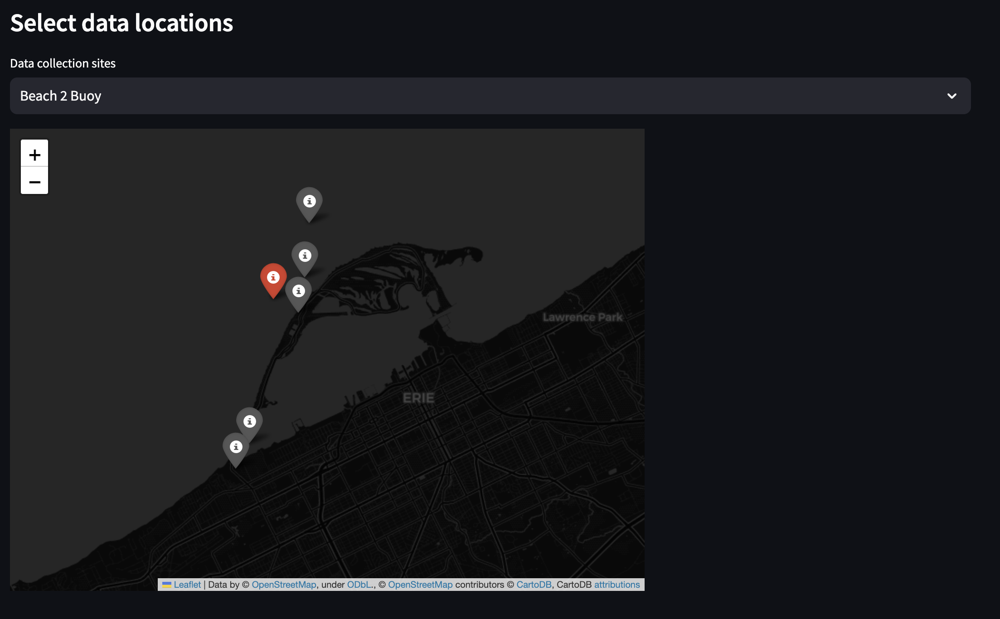
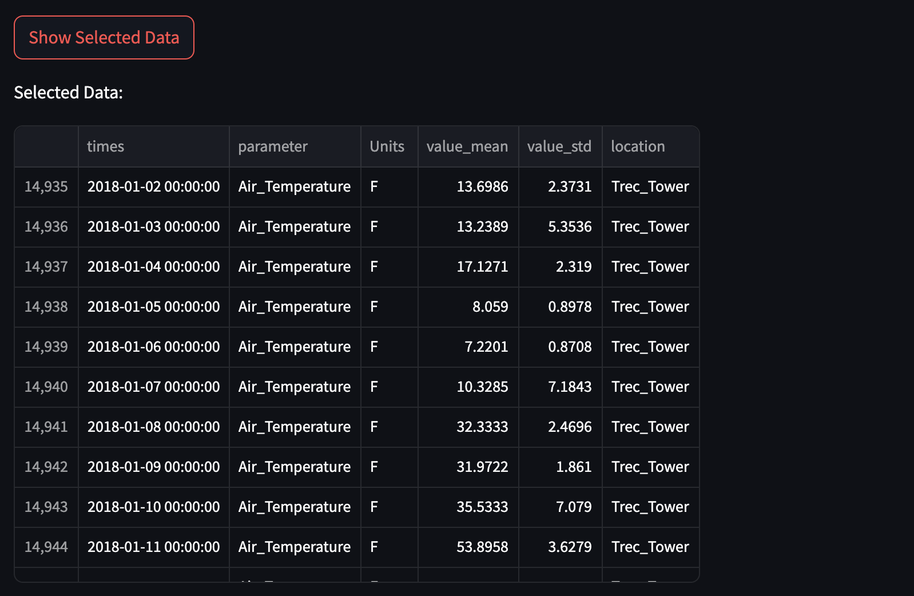
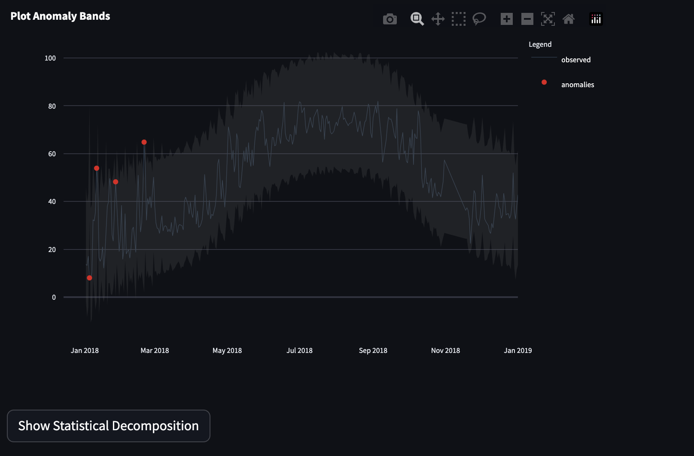
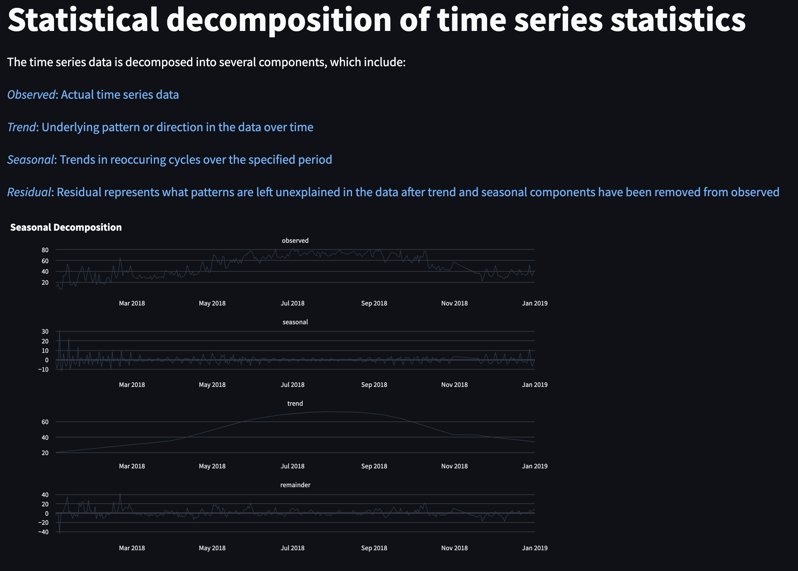

# Lake Erie Project

This code creates a GUI which displays trends in limnological and environmental data from weather bouys and stations in and around Lake Erie. These stations are deployed by the Regional Science Consortium. The user interface will allow stakeholders to view trends in data.

### Users will be able to:

- Explore live data (V2.0)
- Compare climate variables over space and time
- View statistical trends

# Technology Review

Technology Review Presentation Available here:
https://docs.google.com/presentation/d/1Gqygo2uVCjlTfW1YYUflClmrQNrQyhChPKJihoyyjBY/edit?usp=sharing

# Advanced Time series statistics and Anomaly detection

The *Advanced Statistics* page allows the user to further explore Bouy data by examining underlying trends and statistical anomalies in the selected dataset. This is done using the pytimetk library, which is a python library for time series analysis.

https://business-science.github.io/pytimetk

To begin, the user is prompted to select whether they want to view hourly or daily data, and are given a drop down menu of available locations to view data from. One one location may be selected at once. 

Data collection sites are displayed on a dynamic map, which allows the user to zoom in and out, pan around the map, and colors the selected site in **red**. Hovering over the icon in the map will display the name of the site.

Users can then select the Start-date ,end-date, and variable they would like to view from the sidebar. Time series data is then visualized with a smooth line fit to the data in blue. 

**NOTE:** Not all variables are available for all sites and all time periods. Significant data gaps exist in the data. If seleced time period or variable does not exist, no data will be displayed

If the user is interesting in observing the valued displayed, a *Show Selected Data* button is available below the time series plot:  

 This will display the data in a table below the plot. The user has the functionality to scroll through the data, filter each collumn in ascending or descending order, and download the data as a CSV file.

### Anomaly Detection

The second major functionality of the Advanced Statistics dashboard is identifying data points which may be considered anomalies in the time series data. This functionality may allow the user to narrow in on data points or time periods which may have differed from the overall trend of the data and may indicate a significant event. 

Anomalies are identified by detecting underlying seaonal and trend components of the time series data. The user is prompted to enter a number of variables which will be used towards the statistical decomposition which determined data anomalies. These variables are: 

**Period**: The period value determines the window for the seasonal decomposition. The period value is the number of observations per seasonal cycle. For example, if the user is interested in observing seasonal trends in the data, the period value should be set to 365.25 (days in a year). If the user is interested in observing daily trends in the data, the period value should be set to 24 (hours in a day). The default is set to 7, which looks for weekly trends in the data. 

**IQR alpha:** The IQR alpha value is used to determine the threshold for identifying outliers in the data. It is default set to .05, which sets a 5% significance level for determining outliars. The user can adjust this value up or down to to increase or decrease the sensitivity of the anomaly detection.

After selecting the user-prefered variabled for **Period** and **IQR alpha**, the dashboard displays the time series data with added anomaly bands displayed in gray. Data points that fall outside of this range are colored red to clearly indicate that they are considered anomalies given the user-selected parameters. User can hover over these points to get further data. 

Finally, the "Show Statistical Decomposition" button below the plot will display the statistical decomposition of the time series data. This will display the seasonal, trend, and residual components of the data.

